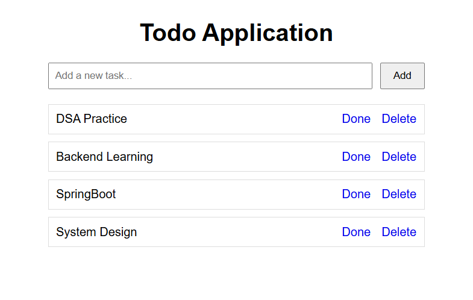

# 📝 Todo Application

A simple and responsive **Todo Application** built using **Spring Boot**, **Spring Data JPA**, **Thymeleaf**, and **MySQL**. The application allows users to create, complete, and delete tasks with a clean web interface.

## 🚀 Features

- ✅ Add new tasks
- 🔄 Mark tasks as completed or undo completion
- 🗑️ Delete tasks
- 📋 View all tasks
- 💾 Persistent data storage using MySQL
- 🌐 Server-side rendering with Thymeleaf

---

## 🛠️ Tech Stack

- Java 21+
- Spring Boot
- Spring Data JPA (Hibernate)
- Thymeleaf
- MySQL
- Maven
- HTML5
- CSS3

---

## 📸 Application Screenshot



---

## 📂 Project Structure

```text
TodoApp
│── src
│   ├── main
│   │   ├── java
│   │   │   └── com.detrox.TodoApp
│   │   │       ├── controller
│   │   │       ├── model
│   │   │       ├── repository
│   │   │       ├── service
│   │   │       └── serviceImpl
│   │   └── resources
│   │       ├── static
│   │       ├── templates
│   │       │   └── tasks.html
│   │       └── application.properties
│── pom.xml
```

---

## ⚙️ Setup Instructions

### 1. Clone the Repository

```bash
git clone https://github.com/your-username/TodoApp.git
cd TodoApp
```

### 2. Configure MySQL

Create a database:

```sql
CREATE DATABASE todoapp;
```

Update `application.properties`:

```properties
spring.datasource.url=jdbc:mysql://localhost:3306/todoapp
spring.datasource.username=root
spring.datasource.password=your_password

spring.jpa.hibernate.ddl-auto=update
spring.jpa.show-sql=true
```

### 3. Run the Application

```bash
mvn spring-boot:run
```

or run the `TodoAppApplication` class directly from your IDE.

---

## 📌 Available Features

| Action | Description |
|---------|-------------|
| Add Task | Create a new task |
| Done | Mark task as completed or undo |
| Delete | Remove a task permanently |


## 👨‍💻 Author

**Harsh**

GitHub: https://github.com/Harshsahu11

---

⭐ If you found this project useful, consider giving it a star!
